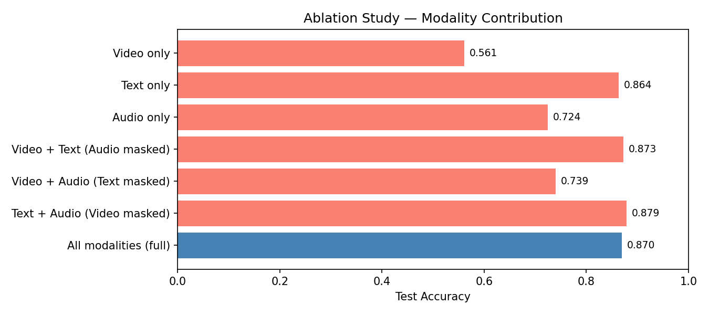
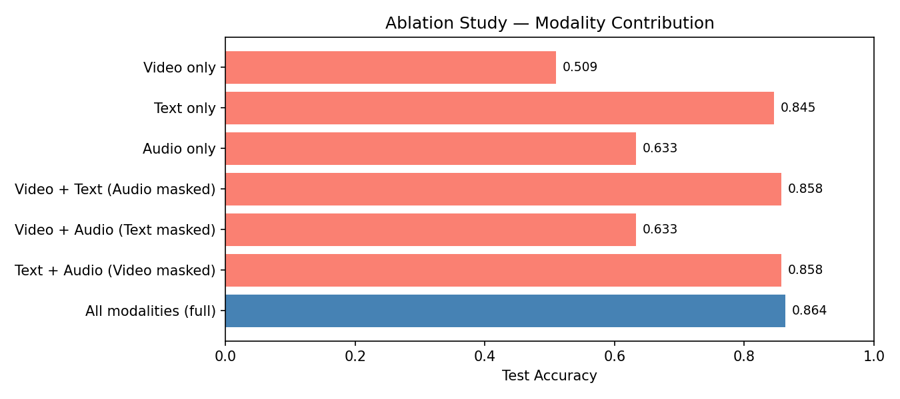
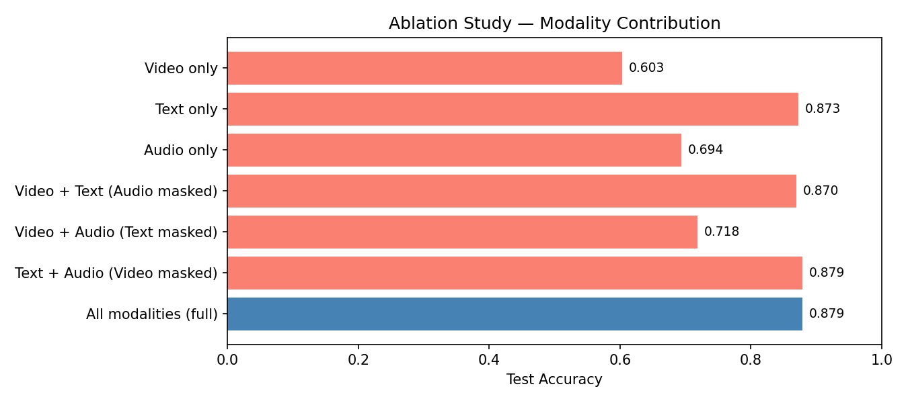
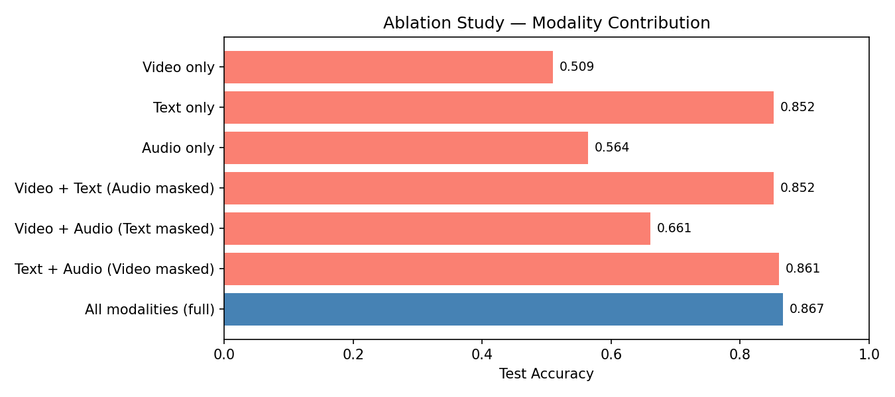
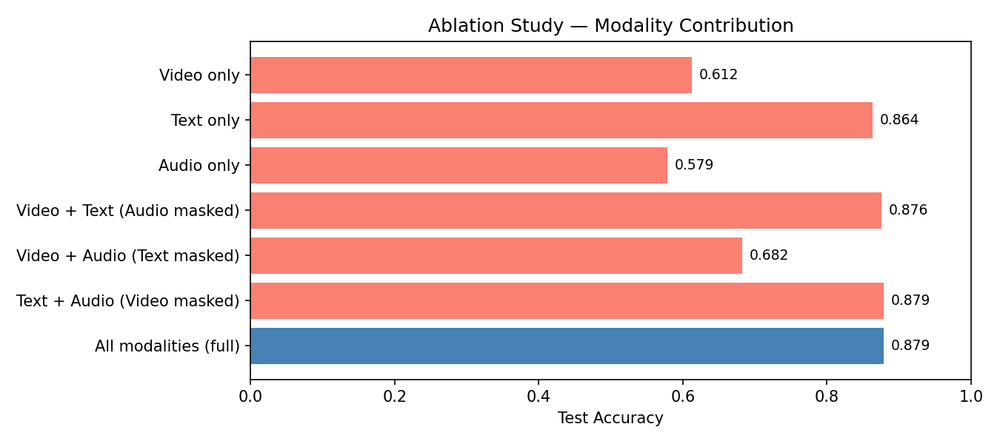
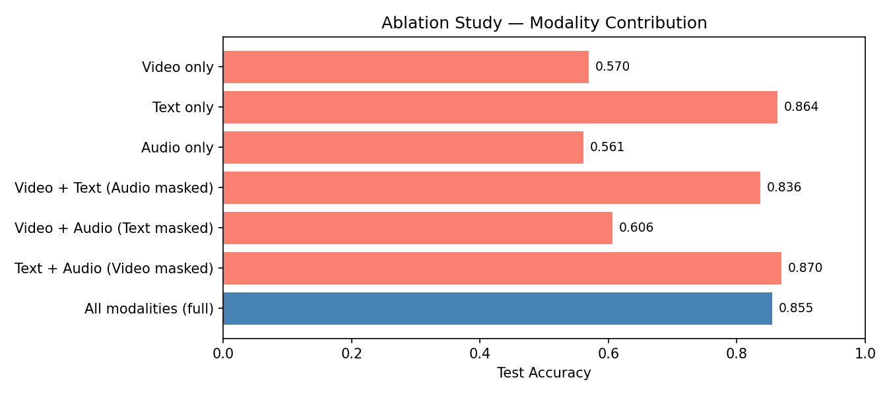

# 딥러닝실습 5조 — Multimodal Sentiment Analysis

> CMU-MOSI 데이터셋 감성 분석 (긍정 / 부정)  
> **Video + Audio + Text** 각 모달리티 256or768-dim 피처 추출 → Cross-Attention Fusion

---

## video.ipynb (영상 모달리티)

### 파이프라인

```
mp4 영상
  ↓  중간 프레임 1장 추출 (cv2)
  ↓  640×480 리사이즈 → MTCNN 얼굴 탐지 → 224×224 or 768x768 크롭
     (탐지 실패 시 전체 이미지 리사이즈로 fallback)
  ↓  pickle 캐싱 (video_preprocessed.pkl)
  ↓  증강 (train에만 적용)
     - 기하학적: RandomHorizontalFlip / RandomRotation(20°) / RandomResizedCrop
                 RandomPerspective / RandomAffine(translate+shear)
     - 색상: ColorJitter / RandomGrayscale
     - 픽셀: GaussianNoise(std=0.08)
  ↓  GroupShuffleSplit — video_id 기준 화자 단위 분할 (Train/Val/Test 누수 방지)
DataLoader
  ↓
VideoEncoder (EfficientNet-B0 or ResNet-18)
  ↓  Linear → BatchNorm → ReLU → Dropout(0.3)
256or768-dim 피처
  ├─ feature_only=False  → 분류 logit  (단독 학습·평가용)
  └─ feature_only=True   → 256or768-dim 벡터 (멀티모달 fusion 입력)
```

### Part 요약

| Part | 내용 |
|------|------|
| 1. 셋업 | 라이브러리, 시드 고정, 경로·상수 (`FEATURE_DIM=768`) |
| 2. 라벨 로드 | `mosi_text_metadata.csv` → `video_id_seg_idx` 키 딕셔너리 생성 |
| 3. 전처리 | 중간 프레임 추출 → MTCNN(배치) → pickle 저장. pkl 있으면 바로 로드 |
| 4. 증강 & DataLoader | 기하학적+색상+노이즈 증강 / **GroupShuffleSplit** (화자 누수 방지) |
| 5. 모델 | `VideoEncoder` — EfficientNet-B0(1280→768) / ResNet-18(512→768) |
| 6. EarlyStopping | patience=5/8, val_acc 기준 최적 가중치 보존 |
| 7. 랜덤 서치 | lr × epoch × weight_decay 랜덤 탐색 (val 기준) |
| 8. 최종 학습 | 최적 config로 재학습 + CosineAnnealingLR + 학습 곡선 저장 |
| 9. 피처 추출 | 베스트 모델로 전체 데이터 256or768-dim 추출 → `video_features_768.pkl` (feat_dict 포맷) |

### 최종 결과 (화자 단위 split 적용)

> 랜덤 split → 화자 단위 split 변경으로 동일 화자의 Train/Test 중복이 제거되어 수치가 낮아짐.  
> 과적합 없는 더 현실적인 평가 기준.

| 모델 | val acc | test acc |
|------|---------|----------|
| EfficientNet-B0 | 0.5881 | 0.4977 |
| ResNet-18 | 0.6278 | **0.5864** |

### 피처 저장 포맷 (`video_features_768.pkl`)

```python
{
  "feat_dict": {
    "video_id_segidx": {          # 예: "03bSnISJMiM_1"
      "feature": tensor(768,),
      "label":   int              # 0=Negative, 1=Positive
    },
    ...
  }
}
```

---

## cross_attention_fusion.ipynb (멀티모달 Fusion)


### 모델 구조

```
Video(768) ─┐  LayerNorm
Text (256) ─┼─► 각 모달리티가 나머지 두 모달리티에 Cross-Attention
Audio(256) ─┘
     │
     ▼
  v' = CrossAttn(Q=v, KV=[t, a])
  t' = CrossAttn(Q=t, KV=[v, a])
  a' = CrossAttn(Q=a, KV=[v, t])
     │
     ▼
  concat([v', t', a'])  →  Linear(768→256) → BN → GELU → Dropout
                        →  Linear(256→64)  → GELU → Dropout
                        →  Linear(64→2)    → logits
```

**CrossAttention 블록**: MHA(Multi-Head Attention, heads=4) + Residual + LayerNorm + FFN

### 노트북 구성

| 섹션 | 내용 |
|------|------|
| 1. 피처 로드 | Video: `feat_dict` 포맷 / Text·Audio: 인덱스 포맷 자동 감지 |
| 2. 레이블 진단 | 세 모달리티 P/N 분포 비교 + 레이블 일치율 출력 → Ground truth 자동 결정 |
| 3. 모델 정의 | `TriModalCrossAttnFusion` — 위 구조 |
| 4. 학습 | AdamW + CosineAnnealingLR + EarlyStopping(patience=10) |
| 5. 학습 곡선 | Loss / Accuracy 시각화 → `fusion_training_curves.png` |
| 6. 테스트 평가 | Accuracy / Macro F1 / Classification Report |
| 7. Confusion Matrix | → `fusion_confusion_matrix.png` |
| 8. Ablation Study | 모달리티별 제로마스킹으로 기여도 분석 → `fusion_ablation.png` |
| 9. 오류 샘플 분석 | 틀린 샘플 ID + 트랜스크립트 테이블 + 얼굴 이미지 그리드 + 오디오 재생 |

### 최종 결과

| 지표 | 값 |
|------|----|
| Val Accuracy  | **89.70%** |
| Test Accuracy | **87.58%** |
| Test Macro F1 | **0.8754** |

### 데이터 파일 배치 (`data/` 폴더)

```
data/
├── video_features_768.pkl             ← video.ipynb 실행 후 생성
├── text_features_256(basic+earlystop).pkl   ← sooyeon 브랜치에서 복사
├── audio_features.pkl                 ← jeein 브랜치에서 복사
├── mosi_text_metadata.csv
├── video_preprocessed.pkl

```

---

## 링크

Figma 선행연구조사: https://www.figma.com/design/EN7aqVx7fGlpnr40zESsVR/%EB%94%A5%EC%8B%A4-%EC%84%A0%ED%96%89%EC%97%B0%EA%B5%AC%EC%A1%B0%EC%82%AC%EA%B8%B0%EB%B0%98-%EA%B8%B0%ED%9A%8D?node-id=0-1&t=zNJREpARBSwNf59X-1

미리 만들어둔 데이터: https://drive.google.com/drive/folders/1AOIqbASofMfZ_9ty0KCn0iGHpJF-1NgW?usp=sharing


---

## 조합 실험

#### (1) 피처 크기가 256 + text basic (output_256_basic 폴더)
VIDEO_PKL = 'data/video_features_256.pkl'   
TEXT_PKL  = 'data/text_features_256(basic+earlystop).pkl'   
AUDIO_PKL = 'data/audio_feat_hubert_origin.pkl'    



```
=== Test 결과 ===
Accuracy : 0.8697 (86.97%)
Macro F1 : 0.8694

              precision    recall  f1-score   support

 Negative(0)       0.85      0.90      0.88       168
 Positive(1)       0.89      0.83      0.86       162

    accuracy                           0.87       330
   macro avg       0.87      0.87      0.87       330
weighted avg       0.87      0.87      0.87       330
```

#### (2) 피처 크기가 256 + text 동결 (output_256_freeze 폴더)
VIDEO_PKL = 'data/video_features_256.pkl'   
TEXT_PKL  = 'data/text_features_256(증강+동결6+earlystop).pkl'   
AUDIO_PKL = 'data/audio_feat_hubert_origin.pkl'  



```
=== Test 결과 ===
Accuracy : 0.8636 (86.36%)
Macro F1 : 0.8636

              precision    recall  f1-score   support

 Negative(0)       0.86      0.87      0.87       168
 Positive(1)       0.86      0.86      0.86       162

    accuracy                           0.86       330
   macro avg       0.86      0.86      0.86       330
weighted avg       0.86      0.86      0.86       330
```


#### (3) 피처 크기가 256 + text basic + audio 증강 (output_256_b_aug 폴더)
VIDEO_PKL = 'data/video_features_256.pkl'   
TEXT_PKL  = 'data/text_features_256(basic+earlystop).pkl'   
AUDIO_PKL = 'data/audio_feat_hubert_aug.pkl'    
 


```
=== Test 결과 ===
Accuracy : 0.8788 (87.88%)
Macro F1 : 0.8784

              precision    recall  f1-score   support

 Negative(0)       0.86      0.92      0.89       168
 Positive(1)       0.91      0.84      0.87       162

    accuracy                           0.88       330
   macro avg       0.88      0.88      0.88       330
weighted avg       0.88      0.88      0.88       330
```


#### (4) 피처 크기가 256 + text 동결 + audio 증강 (output_256_f_aug 폴더)
VIDEO_PKL = 'data/video_features_256.pkl'   
TEXT_PKL  = 'data/text_features_256(증강+동결6+earlystop).pkl'   
AUDIO_PKL = 'data/audio_feat_hubert_aug.pkl'     



```
=== Test 결과 ===
Accuracy : 0.8667 (86.67%)
Macro F1 : 0.8666

              precision    recall  f1-score   support

 Negative(0)       0.87      0.87      0.87       168
 Positive(1)       0.86      0.86      0.86       162

    accuracy                           0.87       330
   macro avg       0.87      0.87      0.87       330
weighted avg       0.87      0.87      0.87       330
```

#### (5) 피처 크기가 768 + text basic (output_768_basic 폴더)
VIDEO_PKL = 'data/video_features_768.pkl'   
TEXT_PKL  = 'data/text_features_768(basic+earlystop).pkl'   
AUDIO_PKL = 'data/audio_hubert_768.pkl'      




```
=== Test 결과 ===
Accuracy : 0.8879 (88.79%)
Macro F1 : 0.8879

              precision    recall  f1-score   support

 Negative(0)       0.89      0.89      0.89       168
 Positive(1)       0.88      0.89      0.89       162

    accuracy                           0.89       330
   macro avg       0.89      0.89      0.89       330
weighted avg       0.89      0.89      0.89       330
```

#### (6) 피처 크기가 768 + text 동결 (output_768_freeze 폴더)
VIDEO_PKL = 'data/video_features_768.pkl'   
TEXT_PKL  = 'data/text_features_768(증강+동결6+earlystop).pkl'   
AUDIO_PKL = 'data/audio_hubert_768.pkl'    



```
=== Test 결과 ===
Accuracy : 0.8545 (85.45%)
Macro F1 : 0.8542

              precision    recall  f1-score   support

 Negative(0)       0.84      0.89      0.86       168
 Positive(1)       0.88      0.82      0.85       162

    accuracy                           0.85       330
   macro avg       0.86      0.85      0.85       330
weighted avg       0.86      0.85      0.85       330

  ```